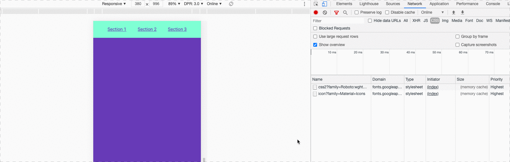

# webpack-media-split

<p style="text-align: center">
    
</p>

## Description

A simple example that splits CSS based on media queries used and generates separate files using Webpack.
Those CSS files are then lazy loaded depending on screen width.

1. Webpack build
2. Postcss example
3. `<link media="">` example

## Run dev server

```
npm start
```

## Build

```
npm run build
```